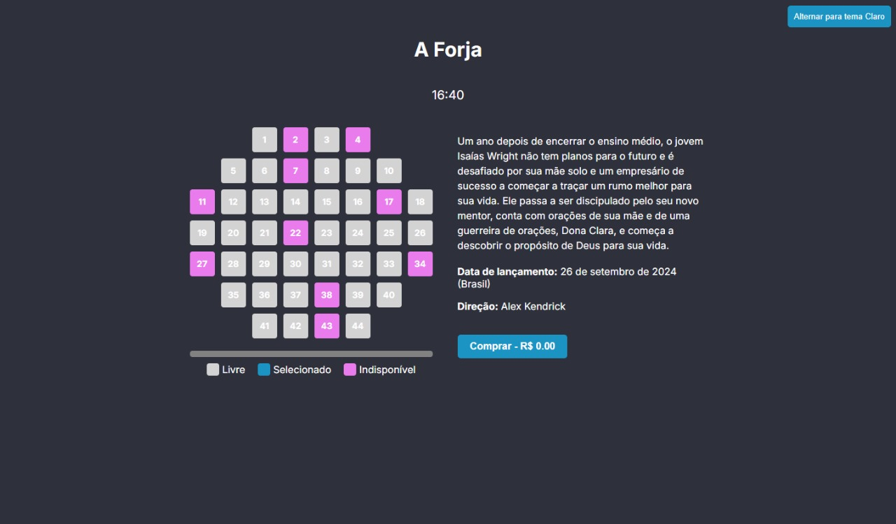

<p align="center">
  
</p>

<h1 align="center" style="font-weight: bold;">POC 6 - Aplicação NextJS</h1>

Desenvolvimento de uma POC (Prova de Conceito) que demonstra o funcionamento de uma interface funcional e responsiva para que os usuários possam selecionar assentos em uma sala de
cinema, exibindo informações do filme e permitindo alterar o tema (claro ou escuro) automaticamente ou manualmente.

<h2 id="tecnologias">💻 Tecnologias</h2>

[](https://skillicons.dev)

<h2 id="comecando">🚀 Desenvolvimento</h2>

1. **Arquivo layout.tsx: Configuração do Layout e Tema**: Define o layout principal do projeto. Ele é responsável por gerenciar o tema, detectando as preferências do sistema e adicionar um botão para alternância manual entre os temas.

Detectar o tema automático com prefers-color-scheme:

```js
const isDarkMode =
window.matchMedia &&
window.matchMedia("(prefers-color-scheme: dark)").matches;
setTheme(isDarkMode ? "dark" : "light");
```

Esse trecho do código utiliza a API `window.matchMedia` para verificar o tema do sistema do usuário.

Botão para alternância manual de tema:

```js
<button onClick={toggleTheme}>
Alternar para tema {theme === "dark" ? "Claro" : "Escuro
</button>
```

Esse botão permite que o usuário mude manualmente entre os temas claro e escuro, mesmo que o sistema esteja configurado automaticamente.

<br>

2. **Arquivo globals.css: Configuração dos Estilos Globais**: O arquivo CSS define as variáveis de cores para os temas claro e escuro. O atributo `data-theme` no elemento HTML determina qual conjunto de variáveis será aplicado.

Definição de variáveis para o tema escuro:

```css
[data-theme="dark"] {
--background: #1a1a24;
--foreground: #f0f0f0;
--primary: #cd4a3e;
}
```

Definição de variáveis para o tema claro:

```css
[data-theme="light"] {
--background: #f0f0f0;
--foreground: #1a1a24;
--primary: #db3d2e;
}
```

Essas variáveis são utilizadas em todo o projeto para garantir a padronização entre os temas.

<br>

3. **Arquivo Cinema.tsx: Componente Principal:**: O componente `Cinema` é responsável por renderizar o título e horário do filme, a grade de assentos, onde cada assento pode ser livre, ocupado ou selecionado, e o botão de compra, que calcula o valor total baseado nos assentos selecionados.

Renderizar a grade de assentos:

```js
{fileiras.map((fileira, i) =>
fileira.map((assento, j) =>
<Assento
key={`L{i}-L{j}`}
numero={assento}
disponivel={dados.assentos[assento - 1].disponivel}
/>
)
)}
```

Este trecho utiliza um mapeamento de arrays para criar a grade de assentos com base nos dados fornecidos no arquivo JSON.

<br>

4. **Arquivo Assento.tsx: Representação de um Assento:** Cada assento é um componente que pode ser selecionado pelo usuário, desde que esteja disponível.

Função para selecionar ou desmarcar um assento:

```js
const handleClick = () => {
if (!disponivel) return;
setSelecionado(!selecionado);
onSelect(numero, !selecionado);
}
```

Esse trecho do código impede a seleção de assentos indisponíveis e atualiza o estado de seleção para o assento correspondente.

<br>

5. **Conclusão**

O projeto combina interatividade com um design responsivo e acessível. Ele permite que o usuário veja as informações do filme, escolha seus assentos e alterne entre os temas claro e escuro. O uso de componentes reutilizáveis e gerenciamento de estado com React torna o código mais organizado e fácil de manipular.

<br>

<h2 id="colabs">🤝 Colaboradores</h2>

- Rafael Trindade Dal Maso
- Fernando Lacava Olival Rodrigues
- Henrique Totti Ulbricht Lapa

<h2 id="contribue">📫 Contribue</h2>

1. **Clone o projeto**: `git clone https://github.com/RafaelMaso/POC6-NextJS.git`
2. **Crie uma branch**: `git checkout -b feature/NAME`

<h3>Documentações que podem ajudar</h3>

[📝 Como criar uma solicitação de Pull Request](https://www.atlassian.com/br/git/tutorials/making-a-pull-request)

[💾 Padrão de Commit](https://gist.github.com/joshbuchea/6f47e86d2510bce28f8e7f42ae84c716)
